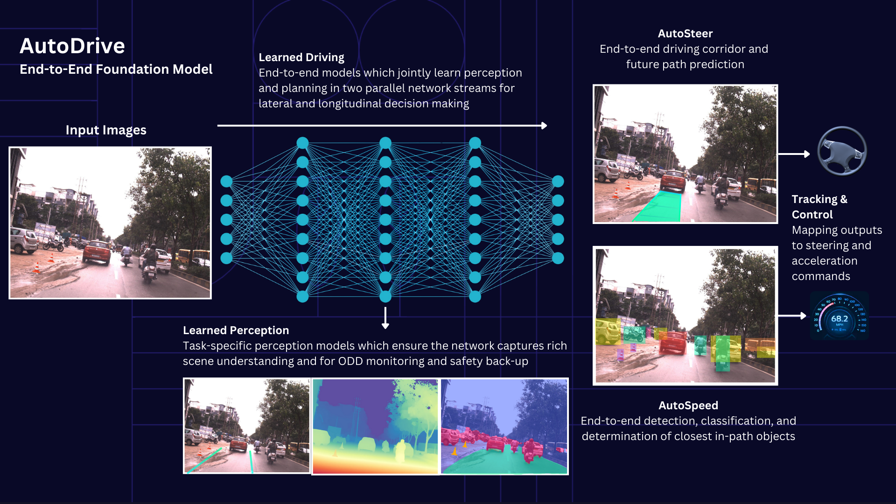
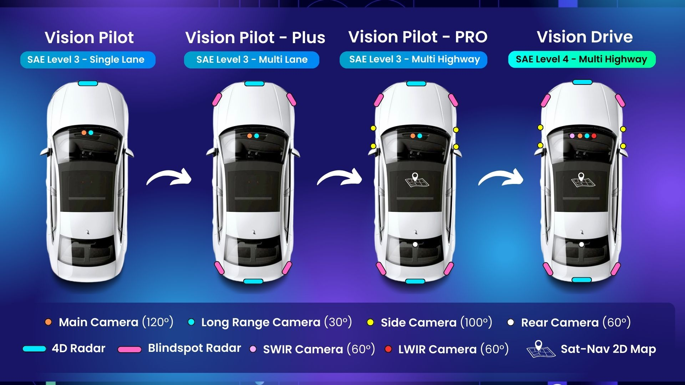

# Introduction

## About Reference Design Guideline for OrV Vehicles

This document serves a guideline to design and deploy a TRL-6 off-road vehicles based on Autoware. The readers can take this document as a starting point to select and configure the hardware and software components of the vehicles.

The Autoware uses the end-to-end foundation model on the off-road vehicles, shown as below.

## Reference Design Guideline for OrV Vehicles documentation structure

The document publishes the guidelines for off-road vehicles (OrV), using the following document structure shown below.

The document consists of four major components:

- ODD Definition defines the operation environment of the OrV.
- Hardware configuration describes the sensors and actuators used on the OrV. There is no reference physical chassis.
- Software configuration describes the process of deploying the software on ECUs.
- Evaluation and testing describes the process of evaluating and testing the software for the OrVs. The dataset and performance metrics are shown.

There are fours phases on designing the software for OrV. The details of the roadmap are discussed on [this page](https://github.com/autowarefoundation/autoware.off-road). Below summarizes the configuration and expected outcomes for each phase. This document provides the design guideline for off-road vehicles.

For more details about the reference design WG, its goals and details of the Autoware Foundation working groups that oversees the project, refer to the [Reference Design WG wiki](https://github.com/autowarefoundation/RefDesignWG/wiki/)

## Getting started

- [System Configuration](./system-configuration/index.md)
- [ODD](./odd-definition/index.md)
- [Hardware Configuration](./hardware-configuration/index.md)
- [Software Configuration](./software-configuration/index.md)
- [Evaluation and Testing](./evaluation-and-testing/index.md)
